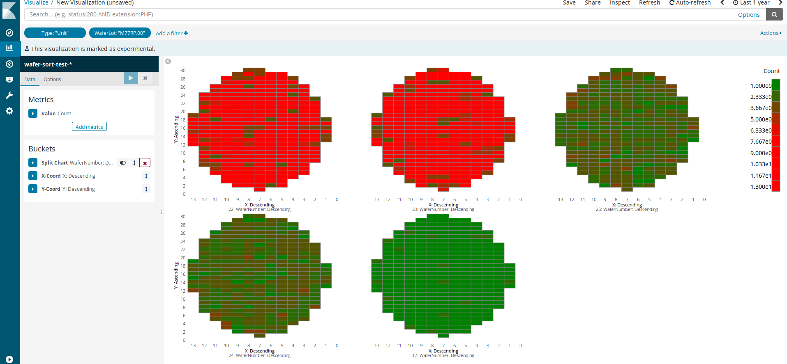
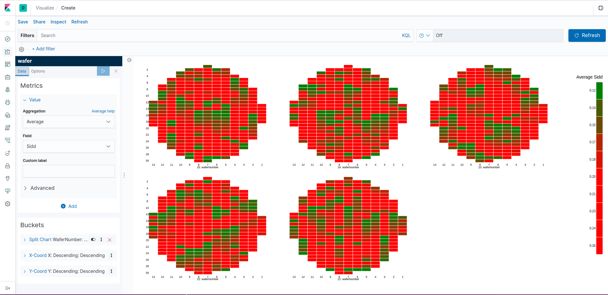
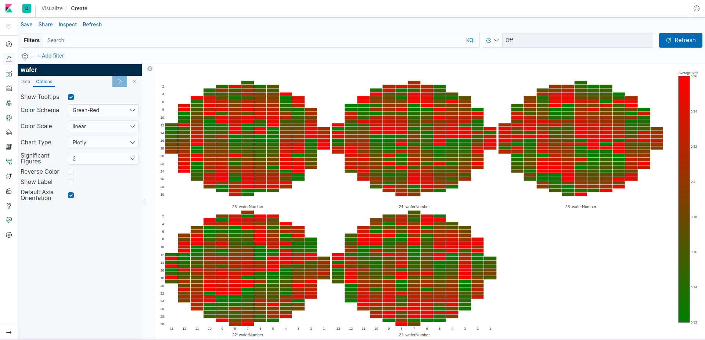
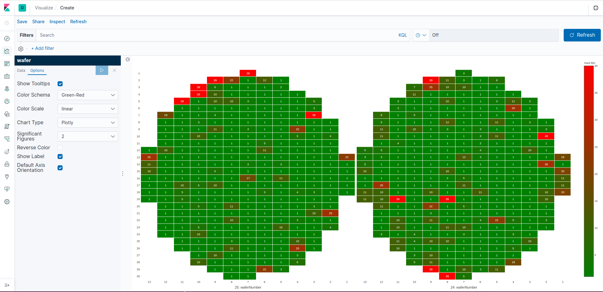
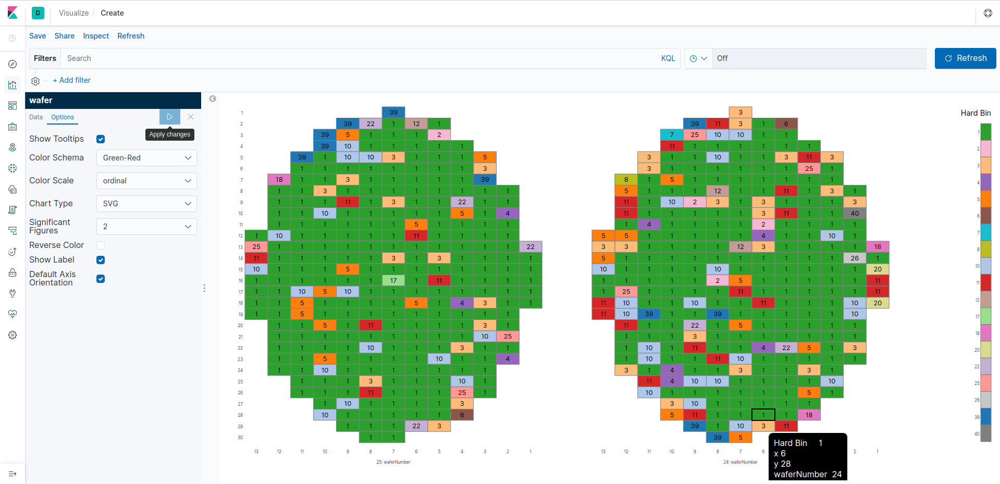

# WaferMap : a kibana plugin to visualize the wafer map



## use case
  - `single wafer binning map, supports customized soft/hard bin color, linear color, and ordinal colors.`
  - `yield of wafer/wafer lots, only supports linear color.`
  - `wafer/wafer lot parametric value map, only supports linear color.`
  - `support chart types: SVG/Canvas and Plotly heatmap.`
  
## tips and limitations 
  - `the x/y must be a number, the mapping type must be the Numberic`
  - `the cell color metric should be also Numberic type, e.g. test value or bin number`
  - `Reverse Color and Color Schema are only for linear color type`
  - `user can modify the Default Axis Orientation[x/asc, y/des] in the kibana.yml`
  - `user need to config the hard/soft bin field name and hard/soft bin color mappings in the kibana.yml if they want to use the customized color`
  - `user can switch the chart type from SVG to Canvas to fast plot the big data size wafer maps`
  - `for wafer/wafer lot yield case, need to add a Pass/Fail flag which must set as a Numberic mapping type, and then the yield is just the sum of Pass/Fail flag field'
  
  ####  sidd-svg
  
  
  ####  sidd-canvas
  
  
  ####  sidd-plotly
  
    
  ####  hardbin-plotly
  
  
  ####  hardbin-svg-ordinal
  
  
  
## example of kibana.yml for wafermap plugin configurations
  - `wafermap.defaultXAxisOrientation: "des"`
  - `wafermap.defaultYAxisOrientation: "asc"`
  - `wafermap.defaultSoftBinName: "SoftBin"`
  - `wafermap.defaultHardBinName: "HardBin"`
  - `wafermap.defaultSoftBinColor: "0-RGB(0,0,0):1-RGB(0,255,0)"`
  - `wafermap.defaultHardBinColor: 0-RGB(0,0,0):1-RGB(0,255,0):2-RGB(0,255,0):3-RGB(0,255,0):4-RGB(0,255,0):5-RGB(0,0,255)`
  
## Installation
please download corresponding release version to match your kibana installation version.
you may need to change the minor version in the `package.json` file to your installed kibana version if needed.
<pre>
./kibana-plugin install https://github.com/guanghaofan/wafermap/releases/download/v7.3.x/wafermap-7.3.x.zip
</pre>

## development

See the [kibana contributing guide](https://github.com/elastic/kibana/blob/master/CONTRIBUTING.md) for instructions setting up your development environment. Once you have completed that, use the following yarn scripts.

  - `yarn kbn bootstrap`

    Install dependencies and crosslink Kibana and all projects/plugins.

    > ***IMPORTANT:*** Use this script instead of `yarn` to install dependencies when switching branches, and re-run it whenever your dependencies change.

  - `yarn start`

    Start kibana and have it include this plugin. You can pass any arguments that you would normally send to `bin/kibana`

      ```
      yarn start --elasticsearch.url http://localhost:9220
      ```

  - `yarn build`

    Build a distributable archive of your plugin.

  - `yarn test:browser`

    Run the browser tests in a real web browser.

  - `yarn test:server`

    Run the server tests using mocha.

For more information about any of these commands run `yarn ${task} --help`. For a full list of tasks checkout the `package.json` file, or run `yarn run`.

